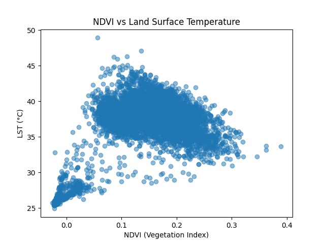
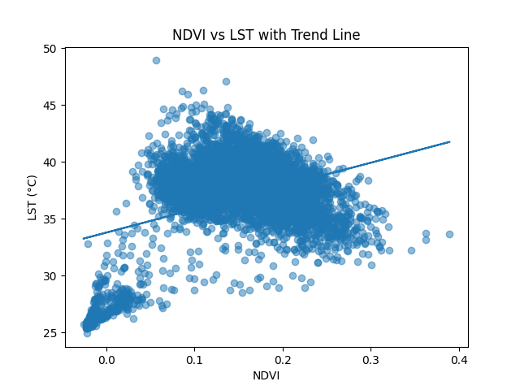
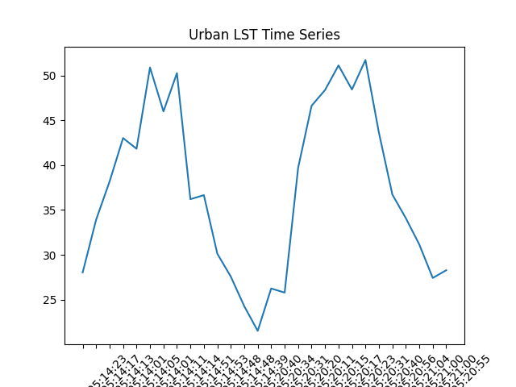
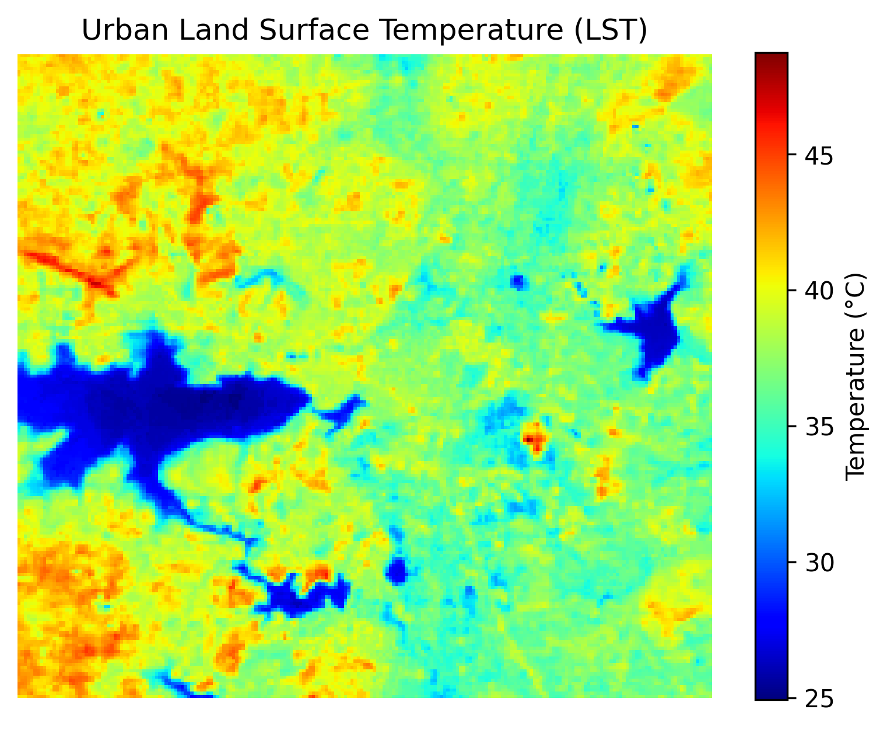

# 🌍 Satellite-Based Land Surface Temperature (LST) Analysis

> End-to-end remote sensing project using Landsat 8 & MODIS to analyze Urban Heat Island (UHI), vegetation–temperature dynamics, and multi-sensor validation.

---

## 🚀 Highlights

* 🌡️ **Urban Heat Island (UHI):** ~**+4°C** higher LST in urban vs rural
* 🌱 **NDVI–LST Relationship:** **r ≈ -0.51** (after cleaning & median compositing)
* 🛰️ **MODIS vs Landsat:** ~**4.7°C** difference due to spatial resolution
* 📈 **Time Series:** Clear seasonal variation with summer peaks

---

## 📁 Project Structure

```
LST-Analysis-Project/
│
├── data/
│   ├── raw/                  
│   └── processed/            
│
├── notebooks/
│   └── lst_analysis.ipynb    
│
├── gee_scripts/
│   ├── landsat_lst.py        
│   └── modis_lst.py          
│
├── results/
│   ├── maps/                 
│   ├── plots/                
│   └── comparison/           
│
├── images/                  
│   ├── ndvi_lst_scatter.png
│   ├── ndvi_lst_trend.png
│   ├── time_series.png
│   └── lst_map.png
│
├── requirements.txt
├── LICENSE
└── README.md
```

---

## 🛰️ Datasets

* **Landsat 8 Collection 2 Level-2** (Surface Reflectance + Thermal)
* **MODIS MOD11A2** (8-day LST)

---

## ⚙️ Methodology

### 1) Preprocessing

* Cloud & shadow masking using `QA_PIXEL`
* ROI definition (Urban vs Rural buffers)

### 2) NDVI

* `NDVI = (NIR - Red) / (NIR + Red)` using Bands (B5, B4)

### 3) Landsat LST

* Thermal conversion → Brightness Temperature
* NDVI-based emissivity (Pv method)
* Final LST (°C) via emissivity correction

### 4) MODIS LST

* Scale factor (0.02) → Kelvin → Celsius

### 5) Analysis

* Urban vs Rural mean LST
* NDVI vs LST (scatter + regression)
* Time series (mean LST)
* Cross-sensor validation (MODIS vs Landsat)

---

## 🧪 Data Cleaning (Critical Step)

To obtain physically consistent NDVI–LST behavior:

* Used **median composite** (reduces temporal noise)
* Applied **NDVI > 0.1 filter** (removes water/bare soil bias)

---

## 📊 Results

* **UHI Effect:** Urban ≈ **+3.99°C** hotter than rural
* **NDVI–LST:** **r = -0.51** (inverse relationship after cleaning)
* **MODIS vs Landsat:** MODIS ≈ **4.7°C lower** (spatial averaging)

---

## 📈 Visuals

* NDVI vs LST Scatter
  

* NDVI vs LST (with Trend)
  `

* Urban LST Time Series
  `

* LST Map
  `

---

## 🧠 Insights

* Vegetation exhibits a **cooling effect** on surface temperature
* Urban materials (asphalt/concrete) drive **heat accumulation**
* **Spatial resolution matters:** fine-scale hotspots are visible only in Landsat

---

## 🛠️ Tech Stack

* **Google Earth Engine (Python API)**
* **Python:** NumPy, Pandas, Matplotlib
* **Geemap** for visualization
* **Google Colab** for execution

---

## ▶️ How to Run

1. Clone this repo
2. Open `notebooks/lst_analysis.ipynb` in Colab
3. Install deps:

   ```bash
   pip install earthengine-api geemap
   ```
4. Authenticate & initialize GEE with your project ID
5. Run all cells

---

## 💼 Resume Bullet

Developed an end-to-end geospatial pipeline to estimate Land Surface Temperature (LST) using Landsat and MODIS. Implemented cloud masking, NDVI-based emissivity correction, and multi-sensor validation to quantify Urban Heat Island effects and vegetation–temperature relationships.

---

## 📌 Future Work

* Multi-year trend (2020–2024)
* Seasonal segmentation (summer vs winter)
* Land cover classification (urban/vegetation/water masks)

---

## 🤝 Contact

Open to collaboration and feedback.
